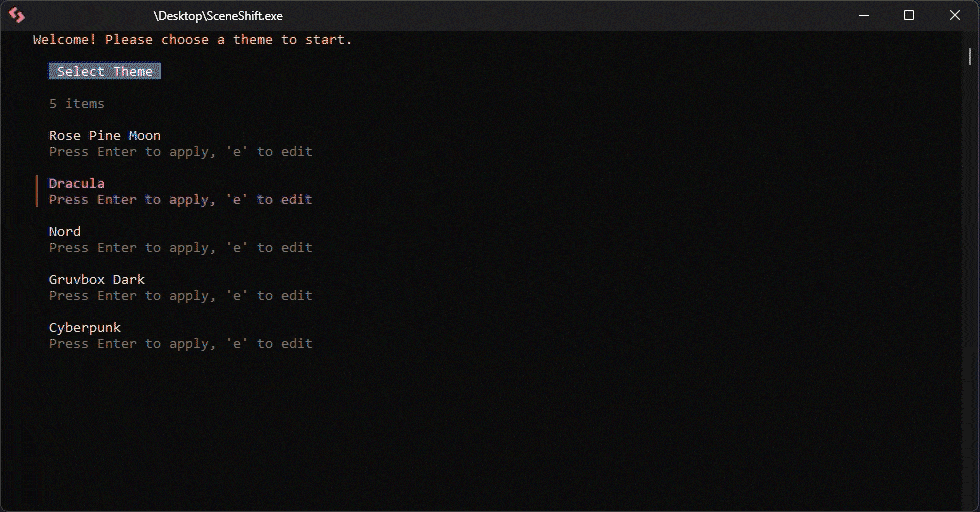

<p align="center">
  
</p>

<h1 align="center">SceneShift 🎮🚀</h1>
  
[](https://github.com/tandukuda/SceneShift/releases/latest)
[](https://go.dev/)
[](https://www.microsoft.com/windows)
[](LICENSE)

**SceneShift** is a terminal-first process optimizer built with Go and Bubble Tea. 

It lets you **kill or suspend background applications**, freeing CPU and RAM before gaming or rendering — clean, fast, and zero-bloat. Think of it as switching into a new “performance scene” for your machine.

  

</div>

---

## 🆕 What's New in v2.1.0

- **🔄 Suspend/Resume**: Freeze processes without killing them - keep your Chrome tabs alive!
- **🛡️ Safelist Protection**: Built-in safety to prevent killing Windows critical processes
- **✨ Better UX**: Improved error messages, visual feedback, and help commands

[See full changelog →](CHANGELOG.md)

---

## 📖 Documentation
**Want to learn more?**
We have moved our detailed guides, configuration options, and advanced usage tricks to our documentation site.

👉 **[Click here to read the SceneShift Documentation](https://tandukuda.github.io/SceneShift/)**

---

## ⚡ Quick Start

You don't need to install Go or compile anything to get started.

### Option 1: via Scoop (Recommended)
The easiest way to install and stay updated.

```powershell
scoop bucket add tandukuda https://github.com/tandukuda/scoop-bucket
scoop install sceneshift
```

### Option 2: Manual Download
If you prefer not to use a package manager:

1.  **Download** the latest `.exe` from the **[Releases Page](https://github.com/tandukuda/SceneShift/releases)**.
2.  **Move** the file to a folder (e.g., `Documents/SceneShift`).
3.  **Run** `SceneShift.exe`.
    * *Note: It will request Administrator permissions to manage your processes.*

### Option 3: Build from Source

```powershell
# Prerequisites: Go 1.21+, rsrc
go install github.com/akavel/rsrc@latest

# Clone and build
git clone https://github.com/tandukuda/sceneshift.git
cd sceneshift
build-release.bat
```

**Requirements:**
- Windows 10/11
- Administrator privileges (required for process management)

---

That's it! Use the **Spacebar** to toggle apps and **K** to kill them.

---

## 🌍 As Seen In

SceneShift has been featured in:

* **[MajorGeeks](https://www.majorgeeks.com/files/details/sceneshift.html)** (Rated 5/5) — *"A Lean, Mean Process Killing Machine"*
* **[Neowin](https://www.neowin.net/software/sceneshift-quickly-close-multiple-apps-at-once/)** — *"Quickly close multiple apps at once"*
* **[Deskmodder](https://www.deskmodder.de/blog/2026/01/03/sceneshift-mehrere-programme-und-hintergrundanwendungen-auf-einmal-beenden/)** — *"End multiple programs and background applications at once"*
* **[YouTube](https://www.youtube.com/watch?v=VB9lv18yqAI)** — *Video Tutorial by Vasudev Menon*

---

## 🛡️ Safety & Disclaimer
SceneShift interacts with system processes. While built with safety in mind, always save your work before using the "Kill" command.

---

## 🤝 Contributing

Contributions are welcome! Please:

1. Fork the repo
2. Create a feature branch (`git checkout -b feature/AmazingFeature`)
3. Commit changes (`git commit -m 'Add AmazingFeature'`)
4. Push to branch (`git push origin feature/AmazingFeature`)
5. Open a Pull Request

### Development Setup

```powershell
# Install dependencies
go mod download

# Build for development
build.bat

# Run
SceneShift.exe
```

---

## 📝 License

This project is licensed under the MIT License - see the [LICENSE](LICENSE) file for details.

---

## 🙏 Acknowledgments

- Built with [Bubble Tea](https://github.com/charmbracelet/bubbletea) by Charm
- Inspired by the need for keyboard-first system management
- Thanks to all contributors and users providing feedback

---

## 🗺️ Roadmap

### v2.2 (Planned)
- [ ] Visual suspension indicators in menu
- [ ] PID-specific resume tracking
- [ ] Session history / Undo feature
- [ ] Process CPU/RAM stats in selection menu

### v3.0 (Future)
- [ ] Linux support
- [ ] macOS support
- [ ] Auto-trigger on game launch
- [ ] Cloud config sync (optional)

---

<div align="center">

**Built with ❤️ by [tandukuda](https://github.com/tandukuda)**

[⭐ Star this repo](https://github.com/tandukuda/sceneshift) • [🐛 Report Bug](https://github.com/tandukuda/sceneshift/issues) • [💡 Request Feature](https://github.com/tandukuda/sceneshift/issues)

</div>
